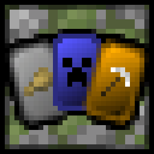

<p align="center">
  
</p>

<h1 align="center">PolyCard</h1>

<p align="center">
  <strong>Collectible card system - find cards and equip them for buffs.</strong>
</p>

<p align="center">
  <a href="https://github.com/RenardElectric/polycard/releases/latest"></a>
  
  
  
  <a href="LICENSE.txt"></a>
</p>

<p align="center">
  <a href="#what-you-can-do">What you can do</a> ·
  <a href="#start-playing">Start playing</a> ·
  <a href="#cards-and-rarities">Cards &amp; rarities</a> ·
  <a href="#server-administrators">Server admins</a> ·
  <a href="#developers">Developers</a>
</p>

PolyCard is a server-side Fabric mod that turns exploration, combat, animal interactions and structure
loot into a collectible-card progression system.

> [!NOTE]
> **Just joining an existing PolyCard server?** You can ignore the
> [server administrator](#server-administrators) and [developer](#developers) sections.

## What you can do

| Functionality                 | What it means in-game                                                                                                               |
|-------------------------------|-------------------------------------------------------------------------------------------------------------------------------------|
| **Collect 24 card families**  | Earn themed cards by breeding, taming, fighting, summoning and exploring structures.                                                |
| **Climb five rarity tiers**   | Cards range from Common to Legendary; every supported tier gets an independent roll and the highest success wins.                   |
| **Unlock stronger powers**    | A higher-rarity card includes its own effect and the effects of its lower supported rarities.                                       |
| **Build a five-card loadout** | Right-click a card to equip it or manage all five slots through an inventory-style GUI.                                             |
| **Upgrade duplicates**        | Turn collected duplicates into a card of the next supported rarity.                                                                 |
| **Track the collection**      | Advancements cover individual rarities, complete card families, groups and the full set.                                            |
| **Play without a client mod** | Acquisition, equipment, cooldowns and effects are handled by the server. Clients only need the matching resource pack for textures. |

## Start playing

### Joining a multiplayer server

1. Add the server in Minecraft and connect as usual.
2. Accept its resource pack when Minecraft asks. This small download supplies the card textures.
3. Open chat and run `/polycard help` to see the commands available to you.

If cards have missing textures, ask the server administrator whether the PolyCard resource pack is
correctly set up.

### Playing in singleplayer

Singleplayer runs its own local server, so PolyCard must be installed in your Fabric game instance.
Follow [Installing PolyCard](#installing-polycard).

### Getting and using your first card

1. Run `/polycard info passive cow` for a concrete example of an acquisition condition, roll chances
   and card effects. Tab completion can help you discover other groups and card types.
2. Perform the listed activity. When a rarity roll succeeds, the card is placed in your inventory.
3. Right-click while holding the card to equip it, or run `/polycard equip` to manage your loadout.
4. Collect ten identical cards, hold the stack in your main hand and run `/polycard combine` to upgrade
   it. A card already at its highest supported rarity cannot be upgraded further.

### Player commands

| Command                                 | What it does                                                            |
|-----------------------------------------|-------------------------------------------------------------------------|
| `/polycard`                             | Show the installed PolyCard version, authors and description.           |
| `/polycard help`                        | List the commands available to you.                                     |
| `/polycard info <cardGroup> <cardType>` | Show how to acquire a card and list its rarity chances and effects.     |
| `/polycard equip`                       | Open your five-slot equipment manager.                                  |
| `/polycard combine`                     | Combine the matching cards held in your main hand into the next rarity. |
| `/polycard cooldown`                    | Show your active card-effect cooldowns in ticks.                        |

## Cards and rarities

### Card collection

| Group       | Card type IDs                                                                                     |
|-------------|---------------------------------------------------------------------------------------------------|
| **Passive** | `cow`, `squid`, `chicken`, `bat`, `horse`, `turtle`                                               |
| **Neutral** | `iron_golem`, `enderman`, `piglin`, `zombified_piglin`, `bee`, `wolf`, `goat`                     |
| **Hostile** | `ender_dragon`, `wither`, `zombie`, `creeper`, `elder_werewolf`, `alpha_werewolf`, `phantom`      |
| **Misc**    | `inventory`, `life`, `totem`, `lucky`, `nether`, `spectator`, `farmer`, `miner`, `random`, `loot` |

Card types do not all begin at Common or support every rarity. The in-game info command is the
authoritative guide for each card's available tiers and effects.

### Rarity system

The global rarity order is:

`Common` → `Uncommon` → `Rare` → `Epic` → `Legendary`

A card at a given rarity includes that rarity's effect plus all effects from its lower supported tiers.
Acquisition uses a separate random roll for every supported rarity, evaluated from lowest to highest:

1. A rarity succeeds when its roll is lower than its configured probability.
2. A later, higher successful rarity replaces any earlier selection.
3. The highest successful rarity is awarded; if every roll fails, no card is awarded.

> [!IMPORTANT]
> A configured probability is an **independent roll chance**, not the final probability of receiving
> exactly that rarity. Higher successful rolls replace lower ones.

<details>
<summary><strong>How final rarity probabilities are calculated</strong></summary>

For rarity `i` with configured probability `pᵢ`:

```text
P(exactly rarity i) = pᵢ × product(1 - pⱼ) for every higher rarity j
P(no card)          = product(1 - pⱼ) for every supported rarity j
```

For independent **20% Common** and **7% Uncommon** rolls:

| Outcome  | Configured chance |            Calculation | Final chance |
|----------|------------------:|-----------------------:|-------------:|
| Common   |           **20%** |       `20% × (1 - 7%)` |    **18.6%** |
| Uncommon |            **7%** |                   `7%` |       **7%** |
| No card  |             **-** | `(1 - 20%) × (1 - 7%)` |    **74.4%** |

The total chance to receive any card is therefore **25.6%**.

</details>

---

## Server administrators

### Requirements

| Component     | Current requirement                                            |
|---------------|----------------------------------------------------------------|
| Minecraft     | `26.3`                                                         |
| Java          | `25` or newer                                                  |
| Fabric Loader | `0.19.5` or newer                                              |
| Fabric API    | `0.160.5+26.3` or newer compatible build                       |
| SGUI          | Bundled inside the PolyCard JAR; no separate download required |

### Installing PolyCard

1. Install Java 25.
2. Install the Minecraft 26.3 version of [Fabric Loader](https://fabricmc.net/use/) for your game or
   dedicated server.
3. Open that game instance or server directory and create a folder named `mods` if it is not present.
4. Download [Fabric API](https://modrinth.com/mod/fabric-api) and place its JAR in the `mods` folder.
5. Download PolyCard from [GitHub Releases](https://github.com/RenardElectric/polycard/releases) and
   place its main JAR in the same `mods` folder.
6. Start the game or server.

For singleplayer, follow these steps in the Fabric Minecraft instance you intend to play. For a
multiplayer server, install PolyCard and Fabric API on the server; connecting players do not need the
PolyCard JAR.

### Client textures

> [!IMPORTANT]
> Gameplay is server-side, but players still need PolyCard's textures. Configure the server to offer a
> matching resource pack and ask players to accept it when joining. Without the pack, cards can show
> missing textures.

[Polymer can include another mod's assets](https://polymer.pb4.eu/latest/user/resource-pack-custom-assets/)
in its generated resource pack and can host that pack through
[AutoHost](https://polymer.pb4.eu/latest/user/resource-pack-hosting/). Polymer is an optional server
tool and is not bundled with PolyHorn.

### Administrative commands

| Command                                                         | What it does                                                                                    |
|-----------------------------------------------------------------|-------------------------------------------------------------------------------------------------|
| `/polycard equip <player>`                                      | Open another online player's equipment manager.                                                 |
| `/polycard give <players> <cardGroup> <cardType> [rarityLevel]` | Give a supported card to one or more players. Omitting the rarity uses the card's minimum tier. |
| `/polycard test <cardGroup> <cardType> [cardsNumber]`           | Simulate rarity rolls. The default is 1,000 rolls; the accepted range is 1–10,000.              |

These commands use Minecraft's **Gamemasters** permission level. All arguments provide tab completion.

### Data and configuration

- PolyCard currently has **no user-editable configuration file**.
- Equipped-card data is saved inside the world as Minecraft `SavedData`, keyed by player UUID.
- Invalid or over-limit stored equipment is validated and repaired when loaded.
- Cooldowns, scheduled tasks and temporary effect state are not persisted across server restarts.

Back up the world as usual before removing the mod or moving a save between incompatible versions.

---

## Developers

### Building from source

#### Prerequisites

- Git
- JDK 25
- No system Gradle installation is required; the repository includes the Gradle 9.7 wrapper.

Clone the repository:

```bash
git clone https://github.com/RenardElectric/polycard.git
cd polycard
```

Generate data before building so generated advancements and item models match the Java definitions.

<details open>
<summary><strong>Windows PowerShell</strong></summary>

```powershell
.\gradlew.bat runDatagen --stacktrace
.\gradlew.bat build --stacktrace
```

</details>

<details>
<summary><strong>Linux / macOS</strong></summary>

```bash
chmod +x ./gradlew
./gradlew runDatagen --stacktrace
./gradlew build --stacktrace
```

</details>

Build artifacts are written to `build/libs/`. The GitHub Actions build follows the same sequence:
`runDatagen` first, then `build`.

### Repository layout

| Path                                       | Purpose                                                                               |
|--------------------------------------------|---------------------------------------------------------------------------------------|
| `src/main/java/polycube/polycard`          | Server runtime, card definitions and effects, commands, events, GUIs, and persistence |
| `src/client/java/polycube/polycard/client` | Data generation entrypoint and generated-model helpers                                |
| `src/main/resources`                       | Fabric metadata, mixins, access widener, textures, models, and other packaged assets  |
| `.github/workflows`                        | Build and release automation                                                          |
| `.github/scripts`                          | Shared CI metadata, release, and summary scripts                                      |

Before submitting a change, run both build commands above and confirm there are no errors.

## Authors and license

PolyCard is made by **RenardElectric** and **Timeo**.

This project is available under the [MIT License](LICENSE.txt).
